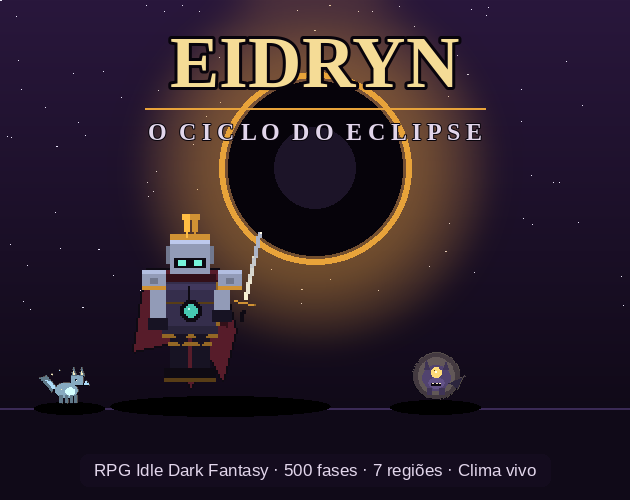

# Eidryn — O Ciclo do Eclipse

*O sol morreu. O que restou foi o Eclipse — e os que se recusam a dele se alimentar.*

**Eidryn** é um RPG idle dark fantasy que roda em **um único arquivo HTML**:
sem instalação, sem servidor, sem login. Abra e jogue — no desktop ou no celular,
até offline.

## O ciclo te espera

Enfraquecido, você desperta o **Selo do Crepúsculo** e marcha por um mundo que
apodreceu sob um sol apagado: 500 fases across 6 regiões — do **Bosque de Vidro
Negro** ao **Coração do Eclipse** — e, além delas, o **Abismo de Velun**, que não
tem fim. O combate é automático; a **construção da sua lenda**, não.

- **Loot com 7 raridades** (Comum → Divina), reforço com pity e fusão
- **7 sets** combináveis — monte builds mix-and-match (2/3 peças)
- **8 pets + 5 companheiros animados**, incluindo dois Míticos e um Divino
- **Portal do Crepúsculo** (gacha) com pity transparente 10/50/100 — sem pegadinha
- 6 masmorras e modos: **Torre Infinita**, **World Boss**, **Arena dos Ecos**
- **Passe de batalha**, missões diárias/semanais, login de 7 dias, 39 conquistas
- Ascensão com árvore de talentos para recomeçar mais forte

## Um mundo vivo

- **Clima dinâmico**: chuva, tempestade com relâmpagos e trovão, neve
- **Poças que refletem** herói, pets e inimigos após a chuva
- **Neblina densa** que engole o Pântano das Lamentações
- **Estações** que pintam cada bioma (primavera/verão/outono/inverno)
- **Áudio ambiente sintetizado** por clima — chuva, vento e trovão gerados em tempo real
- **Eventos ao vivo**: *Fim de Semana Dourado* (sáb/dom), *Eclipse de Sangue* e *Caçada Abissal*

## Para quem é

Para quem gosta de progressão constante, números grandes e decisões de build —
num jogo que **respeita seu tempo**: sem energia, sem anúncios, sem paywall.
O save é seu (export/import com checksum), o progresso é offline.

**Gratis. Jogue no navegador. ☾**

---

### English

*The sun died. What remains is the Eclipse — and those who refuse to feed on it.*

**Eidryn** is a dark-fantasy idle RPG in a **single HTML file**: no install, no
server, no login. Play on desktop or phone, even offline. 500 stages across 6
regions + the endless Abyss, 7 loot rarities, mix-and-match sets, animated pets
& companions (Mythic/Divine included), transparent-pity gacha, dungeons, tower,
arena, battle pass — all wrapped in living weather (rain/storm/snow), reflective
puddles, seasonal biomes and synthesized ambient audio. Free-to-play done fairly:
no energy, no ads, no paywall. Your save, your progress — export anytime.
